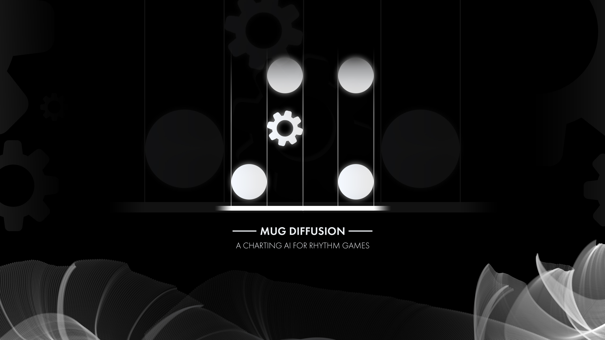
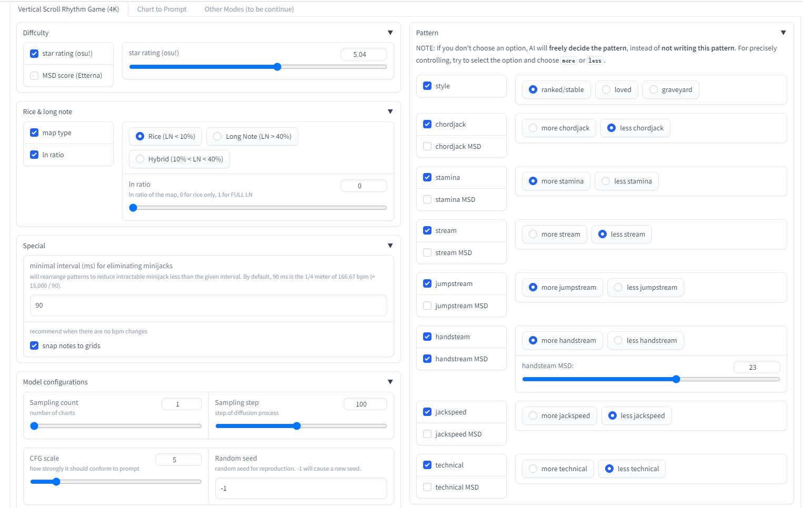
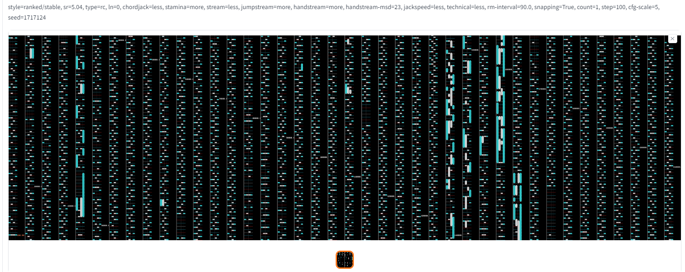

# MuG Diffusion

MuG Diffusion 是一款基于 [Stable Diffusion](https://github.com/CompVis/latent-diffusion/) （最强大的AIGC模型之一） 的音游谱面制作AI，并进行了大量修改以整合音频波。给它一个音频文件，MuG Diffusion 能够为其生成高质量的多样化谱面，这些谱面与音乐保持同步，并且高度可控。目前，它仅支持4K传统下落式音游（VSRG），有以下参数控制选项：

- 难度：同时支持 [osu! star rating system](https://osu.ppy.sh/wiki/en/Beatmap/Star_rating) 和 [Etterna MSD system](https://etternaonline.com/) 。
- 风格：ranked 谱面（[osu!](https://osu.ppy.sh/)） / stable 谱面 （[Malody](https://m.mugzone.net/)） ，与其它谱面风格。 
- 面条：面条占总物量的比率。
- 模式：支持 Etterna MSD 系统的所有模式，包括 chordjack，stamina，stream，jumpstream，handstream 和 technical。

MuG Diffusion 未来的目标是支持其它音游（osu!standard，下落式5-8K，maimai等），并且希望能够成为一款对于所有谱师和玩家都有利的AIGC工具。




## 安装与运行

### 使用整合包

我打包了一份包含 Windows 平台中所有的依赖项和模型权重，双击即可直接运行的整合包，可以在下方获取。

- [Google Drive](https://drive.google.com/file/d/1-TmLsveLAjRCPwd0iwXS7V1v61MlQ7DM/view?usp=share_link)
- [hiosu](https://dl2.hiosu.com/d/kuit/MugDiffusion.zip)


解压整合包并双击打开“Mug Diffusion.exe”，将会自动打开浏览器网页控制台。在我的电脑上（NVidia RTX 3050Ti，4GB显存），为一条3分钟长的音频生成4张谱面大约需要30秒。


### 运行源代码

如果您使用其它平台、其他显卡或希望从源代码运行，以下为说明。

- 安装 [Python](https://www.python.org/downloads/)

- 安装 [PyTorch](https://pytorch.org/get-started/locally/)

- 安装其它依赖包：

```commandline
pip install -r requirements.txt
```

- 安装 [FFmpeg](https://ffmpeg.org/download.html)，确保 `ffmpeg` 命令可以正常运行。

- 下载整合包，并复制文件 `models/ckpt/model.ckpt` 和 `models/ckpt/model.yaml` 到 `{REPOSITORY_ROOT}/models/ckpt/*` 目录下。

- 运行网页控制台：

```commandline
python webui.py
```

## 模型结构与方法


## 致谢

为了确保训练的公平度与透明度，数据集的谱面列表公开在[此处](https://mugdiffusion.keytoix.vip/dataset.html)。

感谢社区中的每一位谱师。是你们赋予了 MuG Diffusion 灵性。此外，我必须感谢 [Malody](https://m.mugzone.net/) 开发团队（以及许多其它由于篇幅限制而无法列出的支持者 TAT）的财力支持。

感谢 [raber](https://github.com/zengrber) 对于网页控制台的开发， [RiceSS](https://osu.ppy.sh/users/8271436) 的图标设计，还有许多其它测试人员的大力支持。

特别感谢： 
- [kangalio](https://github.com/kangalio/)：源于 [MinaCalc-standalone](https://github.com/kangalio/minacalc-standalone)，MSD控制系统的一个组件。
- [Evening](https://github.com/Eve-ning/)：源于 [reamberPy](https://github.com/Eve-ning/reamberPy)，提供了谱面生成非常直观的可视化预览。

## 声明

通过 Mug Diffusion 生成的谱面完全开源，明确遵循 [CC0 1.0](https://creativecommons.org/publicdomain/zero/1.0/) 通用公共领域专用协议。

此外，所有由AI生成的谱面都在 `[Meta]` 部分标有 `AIMode: MuG Diffusion vx.x.x`。**请保持其完整性或明确说明，除非你修改了谱面大部分的配置，否则你将有滥用AI的风险。**
